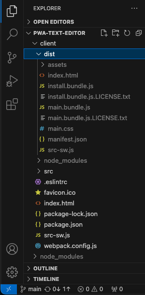
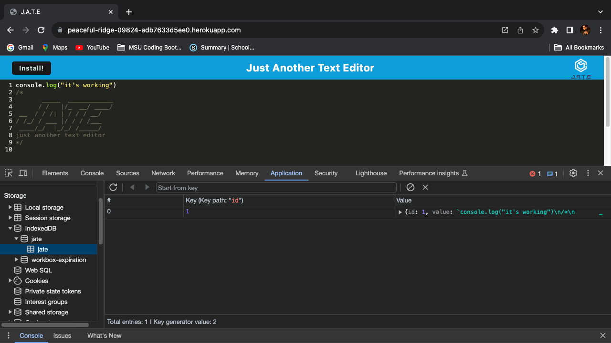
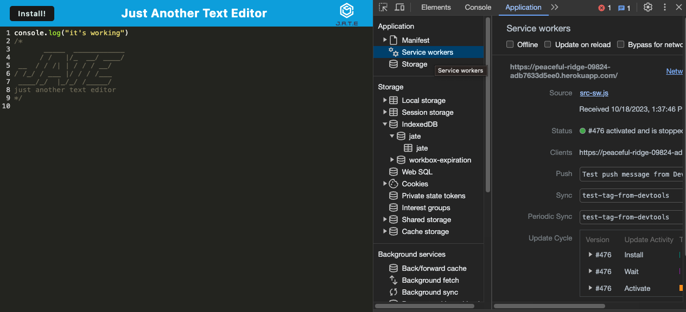
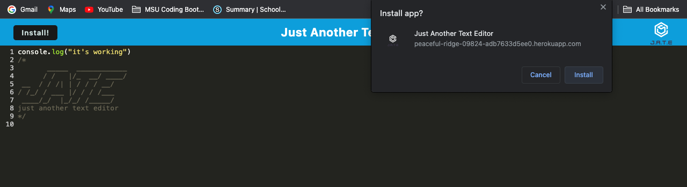
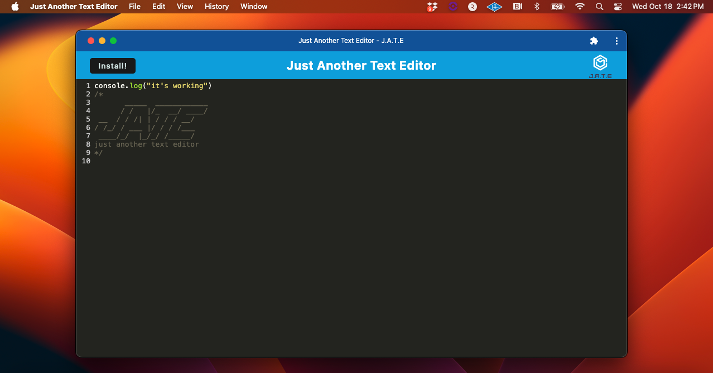

# PWA Text Editor

## Description

A text editor that runs in the browser. The app is a single-page application that meets the PWA criteria. It features a number of data persistence techniques that serve as redundancy in case one of the options is not supported by the browser. The application also functions offline.

## Usage 

Upon opening the application in VSCode a client/server folder structure is present.

When the text application is run in the terminal the the backend starts and is served to the client, the javascript files are bundled using webpack, and a HTML file, service worker and a manifest file is generated. 

The application runs without errors while using next-gen javascript and was deployed through Heroku.  If data is entered into the app and the cursor looses focus that data is saved with IndexedDB.  The data in the DB then repopulates the text editor when the page is refreshed. 

The app uses a registered service worker.

When the Install button is clicked a prompt asks wether or if you would like to install the app.  When you click on Install in the prompt the app is installed to your computer and functions correctly.

[Github Repository](https://github.com/KKurzawa/PWA-Text-Editor)

[Demo](https://peaceful-ridge-09824-adb7633d5ee0.herokuapp.com/)

## Credits

n/a

## Questions

[Github Profile](https://github.com/KKurzawa)

Email me at kurzawa1@yahoo.com for questions.

## License

MIT License

Copyright (c) 2023 Kris Kurzawa
